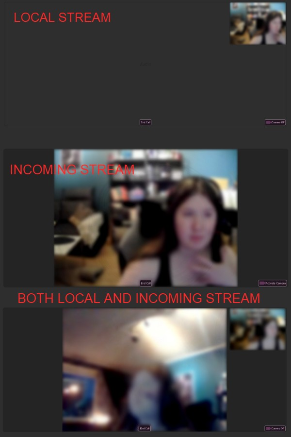

# &lt;video-audio-chat&gt;

A component that handles audio and video communication between two users in a unique chat session using WebRTC and WebSocket.

## Custom Events

### `endCall`

Called when a user wants to end the call and return to the text chat.

## Functionality

### Audio

At the start the communication is only made with audio when the component is inserted into the DOM and a connection is made with the other client.

### Video

When the call is initialized the user can press the "Activate Camera" button to set up a connection stream with their camera and the other user, this can be made from both clients independently of one another.

## WebSocket Configuration

This project communicates with a WebSocket server for real time updates.

### WebSocket Server Address

The WebSocket connections are established with the following server address where the :id defines the unique chat ID:

`wss://cscloud6-191.lnu.se/chatterbox/:id`

## Example

