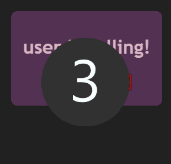

# &lt;call-display&gt;

A simple component that shows the user a call being made and to accept or deny that call.

## Methods

### `setCaller(username, ID)`

Sets the callers username and ID.

#### Arguments

 - First parameter is a string representing the callers username.
 - Second parameter is a string representing the callers unique ID.

## Custom Events

### `callAccepted`

Triggers when the user accepts the call.

### `callDenied`

Triggers when the user denies the call.

## Example

Also plays a tune when calling and a different audio when the call is denied.
