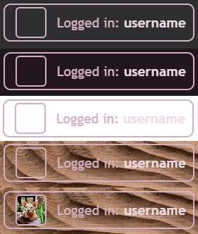

# &lt;logged-in-box&gt;

A simple webcomponent that displays a profile image and username of a user that is logged in for better reusability.

Possible future implementations could be to incorporate showing different user states aswell ('do not disturb', 'away' etc.)

## Attributes

`name="username"`

An attribute that sets the name of the user.

Default value: undefined.

## Customization

You can insert a profile image into the component by inserting an `img` element in it with the `slot="profile"` attribute.

```html
<logged-in-box>
  
</logged-in-box>
```

## Example

The component is transparent så it can be used on any background.



1. gray
2. dark purple
3. white
4. textured
5. textured with a profile image